# Kakak Agent - Intelligent Multi-Channel Customer Support System

**Team:** Three Musketeers -Ewen Cheung,Ng Shi Yang, Saw Yong Xuen

**Competition:** AI Hackathon 2025  

---

## 🎯 Problem Statement

Most chatbot only handles preset answers, so if a customer phrases a question differently, the bot gets stuck

Staff then have to manually check documents, reply, and update calendars — leading to delayed responses, missed bookings, and frustrated customers

- Handle multiple channels (Telegram, future: WhatsApp, Web Chat) 
- Understand context and maintain conversation memory
- Access and search through company knowledge bases
- Manage appointments and calendar scheduling
- Create and track support tickets
- Provide daily business insights and summaries

**Why This Matters:**
- 67% of customers expect 24/7 support availability
- Poor customer service costs businesses $75 billion annually in the US alone
- SMEs lose 30% of potential customers due to delayed response times
- Manual ticket management reduces productivity by 40%

---

## 💡 Solution Overview

**Kakak Agent** is an innovative, multi-agent AI customer support platform designed to empower every business with their own personalized AI assistant—set up in just a few clicks. Built for simplicity and power, Kakak Agent enables anyone, regardless of technical background, to launch a fully customized support agent that understands your company’s knowledge, manages appointments, handles tickets, and communicates naturally with customers across multiple channels like Telegram. With seamless integration, persistent memory, and advanced language capabilities, Kakak Agent transforms customer service into a 24/7, intelligent, and brand-aligned experience—making world-class support accessible to everyone.

### Key Capabilities:
🤖 **Multi-Agent Intelligence** - Specialized agents for scheduling, ticketing, web search, and business insights  
📚 **Knowledge Base Integration** - RAG-powered document search and AI-driven responses  
🧠 **Conversation Memory** - Persistent context awareness across sessions using Mem0  
🌐 **Real-time Information** - Web search capabilities for current events and data  
�️ **Multi-Language Support** - Native conversations in 15+ languages powered by Claude 3 Haiku
�📅 **Calendar Management** - Google Calendar integration for appointment scheduling  
🎫 **Smart Ticketing** - Automated ticket creation, tracking, and escalation  
📊 **Business Dashboard** - Real-time analytics and daily digest reports  
🔗 **Multi-Channel Support** - Telegram (implemented) with extensible architecture  
⚡ **Asynchronous Processing** - Background worker for optimal performance  

---

## 🛠️ Methodology

### Agent-Based Architecture
The system employs a **hierarchical multi-agent approach** where each agent specializes in specific domains:

1. **Orchestrator Agent**: Central coordinator with memory awareness that analyzes user intent and delegates to specialist agents
2. **Scheduler Agent**: Manages calendar operations and appointment booking with Google Calendar integration
3. **Ticketing Agent**: Creates, updates, and tracks support tickets with priority management
4. **Web Search Agent**: Retrieves real-time information from the internet when knowledge base is insufficient
5. **Daily Digest Agent**: Generates business insights and summaries from tickets and calendar events

### AI Technologies Used:
- **Large Language Models**: Amazon Bedrock (Claude 3 Haiku) for natural language processing
- **Vector Embeddings**: Amazon Titan Embed for semantic search
- **RAG (Retrieval-Augmented Generation)**: ChromaDB for knowledge base search
- **Document Processing**: Docling for PDF parsing and chunking
- **Agent Framework**: Strands AI for agent orchestration
- **Memory System**: Mem0 for conversation memory and user context persistence
- **Real-time Search**: Tavily API for current information retrieval

### Integration Strategy:
- **Telegram Bot API** for real-time messaging
- **Google Calendar API** for scheduling management  
- **SQLite Database** for data persistence and conversation memory
- **FastAPI** for scalable backend architecture
- **React Frontend** for business dashboard
- **Background Worker** for asynchronous message processing
- **Memory System (Mem0)** for conversation context and user preferences

## How Kakak Agent Works
1. A customer sends a message on Telegram.
2. The message is instantly received by our Telegram bot.
3. Telegram forwards the message to our backend system using a secure webhook.
4. The backend adds the message to a queue, so nothing gets missed—even if lots of people are messaging at once.
5. A background worker picks up the message from the queue and gets to work.
6. The Orchestrator Agent (the “brain” of the system) reads the message, checks past conversations, and figures out what the customer needs.
7. If needed, the Orchestrator asks specialist agents for help—like the Scheduler for appointments, Ticketing for support issues, or Web Search for real-time info.
8. The agents can look up information in your company’s knowledge base, check the calendar, or even search the web to find the best answer.
9. Once the right response is ready, the system sends it back to the customer on Telegram—fast and friendly.
10. Meanwhile, all conversations and actions are saved, so the agent remembers each customer and can provide personalized service next time.
11. Business owners and staff can monitor everything, upload new documents, and adjust settings easily from the dashboard.

---

## 🏗️ Technical Architecture

### System Architecture Diagram

```mermaid
graph TB
    %% === User Layer ===
    Customer[Customer via Telegram]
    
    %% === Frontend Layer ===
    subgraph "Frontend Dashboard (React)"
        Dashboard[Business Dashboard]
        Config[Configuration Panel]
        KB[Knowledge Base Upload]
        Channel[Channel Management]
    end
    
    %% === Communication Channel ===
    Telegram[Telegram Bot API]
    
    %% === Backend Core ===
    subgraph "Backend Core (FastAPI)"
        API[API Gateway]
        Worker[Background Worker]
        Queue[(Message Queue)]
    end
    
    %% === AI Intelligence Layer ===
    subgraph "AI Intelligence Layer"
        subgraph "Orchestrator Core"
            Orchestrator[Memory-Aware Orchestrator]
            Memory[Mem0 Memory System]
        end
        
        subgraph "Specialist Agents"
            Scheduler[Scheduler Agent]
            Ticketing[Ticketing Agent]
            WebSearch[Web Search Agent]
            Digest[Daily Digest Agent]
        end
        
        subgraph "AI Tools"
            KBSearch[Knowledge Base Search]
            MessageSend[Message Sender]
        end
    end
    
    %% === Data Storage Layer ===
    subgraph "Data Storage Layer"
        SQLite[(SQLite Database)]
        Vector[(ChromaDB Vector Store)]
        Files[File Storage]
    end
    
    %% === External Services ===
    subgraph "External AI & APIs"
        Bedrock[Amazon Bedrock<br/>Claude 3 Haiku]
        GCal[Google Calendar API]
        Tavily[Tavily Search API]
    end
    
    %% === Primary User Flow ===
    Customer -->|sends message| Telegram
    Telegram -->|webhook| API
    API -->|queues| Queue
    Worker -->|processes| Queue
    Worker -->|invokes| Orchestrator
    
    %% === AI Processing Flow ===
    Orchestrator -.->|retrieves context| Memory
    Orchestrator -->|delegates to| Scheduler
    Orchestrator -->|delegates to| Ticketing
    Orchestrator -->|delegates to| WebSearch
    Orchestrator -->|uses| KBSearch
    Orchestrator -->|responds via| MessageSend
    Dashboard -->|delegates to| Digest
    
    %% === Frontend Admin Flow ===
    Dashboard -->|monitoring| API
    Config -->|settings| API
    KB -->|upload docs| API
    Channel -->|manage| API
    
    %% === External Integrations ===
    Scheduler -->|manages events| GCal
    WebSearch -->|real-time search| Tavily
    MessageSend -->|sends replies| Telegram
    
    %% === Data Persistence ===
    Scheduler -.->|stores appointments| SQLite
    Ticketing -.->|stores tickets| SQLite
    Digest -.->|stores reports| SQLite
    Memory -.->|stores conversations| SQLite
    KBSearch -.->|semantic search| Vector
    Files -.->|document storage| SQLite
    
    %% === AI Service Connections ===
    Orchestrator -.->|LLM calls| Bedrock
    Scheduler -.->|LLM calls| Bedrock
    Ticketing -.->|LLM calls| Bedrock
    WebSearch -.->|LLM calls| Bedrock
    Digest -.->|LLM calls| Bedrock
    Memory -.->|embeddings| Bedrock
    KBSearch -.->|embeddings| Bedrock
    
    %% === Styling ===
    classDef user fill:#ffebee,stroke:#d32f2f,stroke-width:3px,color:#000
    classDef frontend fill:#e3f2fd,stroke:#1976d2,stroke-width:2px,color:#000
    classDef backend fill:#fff3e0,stroke:#f57c00,stroke-width:2px,color:#000
    classDef orchestrator fill:#f3e5f5,stroke:#7b1fa2,stroke-width:3px,color:#000
    classDef agents fill:#fff8e1,stroke:#ffa000,stroke-width:2px,color:#000
    classDef tools fill:#e8f5e9,stroke:#388e3c,stroke-width:2px,color:#000
    classDef data fill:#e0f2f1,stroke:#00796b,stroke-width:2px,color:#000
    classDef external fill:#fce4ec,stroke:#c2185b,stroke-width:2px,color:#000
    classDef channel fill:#e1f5fe,stroke:#0277bd,stroke-width:2px,color:#000
    
    class Customer user
    class Dashboard,Config,KB,Channel frontend
    class API,Worker,Queue backend
    class Orchestrator,Memory orchestrator
    class Scheduler,Ticketing,WebSearch,Digest agents
    class KBSearch,MessageSend tools
    class SQLite,Vector,Files data
    class Bedrock,GCal,Tavily external
    class Telegram channel
```



**Architecture Legend:**
- **Customer**: End users interacting via Telegram
- **API Gateway**: FastAPI backend handling all requests
- **Background Worker**: Async message processor
- **Orchestrator**: Central AI coordinator with memory
- **Specialist Agents**: Domain-specific AI agents
- **Knowledge Base**: RAG system for company docs
- **Memory System**: Persistent conversation context
- **Databases**: SQLite for structured data, ChromaDB for vectors
- **Amazon Bedrock**: Claude 3 Haiku LLM & Titan embeddings

### Technology Stack

#### Backend:
- **Framework**: FastAPI with async/await support
- **AI Platform**: Amazon Bedrock (Claude 3 Haiku, Titan Embeddings)
- **Agent Framework**: Strands AI for agent orchestration
- **Memory System**: Mem0 for conversation memory and context persistence
- **Vector Database**: ChromaDB for semantic search
- **Database**: SQLite with SQLAlchemy ORM
- **Document Processing**: Docling for PDF parsing
- **Real-time Search**: Tavily API for current information retrieval
- **Background Processing**: Async worker for message queue processing
- **API Integration**: Google Calendar API, Telegram Bot API

#### Frontend:
- **Framework**: React 18 with functional components
- **Styling**: Tailwind CSS for responsive design
- **State Management**: React hooks (useState, useEffect)
- **Routing**: React Router for SPA navigation
- **HTTP Client**: Fetch API for backend communication

#### Infrastructure:
- **Development**: Python 3.11+, Node.js, npm
- **Environment**: Virtual environment management
- **Configuration**: Environment variables and database-stored configs
- **File Handling**: Multi-file upload with content type detection
- **Message Processing**: SQLite-based queue with background worker
- **Memory Storage**: Persistent conversation context via Mem0

---

## 🎁 Benefits Delivered

### For End Customers:
- **24/7 Availability**: Instant responses to inquiries anytime
- **Intelligent Responses**: Context-aware conversations with access to company knowledge
- **Seamless Scheduling**: Easy appointment booking through natural language
- **Multi-Channel Access**: Consistent experience across communication platforms

### Technical Benefits:
- **Modular Architecture**: Easy to extend with new agents and channels
- **Cloud-Native**: Leverages AWS services for scalability and reliability
- **API-First Design**: Enables integration with existing business systems
- **Real-Time Processing**: Asynchronous background tasks for optimal performance
- **Secure Configuration**: Database-stored credentials and environment-based settings
- **Memory-Aware**: Persistent conversation context for personalized interactions
- **Current Information**: Real-time web search for up-to-date responses

---

## 🛣️ Roadmap and Future Potential

### Phase 1 (Current) - Foundation ✅
- Multi-agent architecture implementation
- Memory-aware orchestrator with Mem0 integration
- Telegram integration with background worker processing
- Knowledge base RAG system with ChromaDB
- Real-time web search capabilities via Tavily
- Calendar management with Google Calendar API
- Support ticket system with priority management
- Business dashboard with daily digest functionality
- Native conversations in 15+ languages including English, Chinese, and Spanish

### Phase 2 - Enhanced Intelligence & Multi-Channel 🧠
- **Advanced Sentiment Analysis**: Automatic escalation based on customer emotion and urgency
- **Voice Integration**: WhatsApp voice message processing and voice-to-text capabilities
- **Multi-Modal AI**: Process images, documents, and voice messages intelligently
- **Predictive Customer Service**: ML models predicting customer needs and proactive support
- **Smart Document Processing**: Automatic parsing of contracts, invoices, and business documents
- **Cross-Channel Orchestration**: Seamless customer journey across WhatsApp, Email, and Web Chat
- **Advanced Analytics Dashboard**: Real-time insights, customer behavior analysis, and business metrics
- **Custom Business Intelligence**: AI-powered BI dashboards tailored for each company's KPIs and metrics
- **Parallel Request Handling**: Efficiently manage and respond to multiple customer requests at the same time

### Phase 3 - Enterprise Integration & AI Workforce 🚀
- **Enterprise Connectors**: Native integration with Salesforce, HubSpot, Slack, and major CRM systems
- **Custom AI Agent Creation**: Build specialized agents for specific business functions
- **Advanced Workflow Automation**: AI-driven business process automation and optimization
- **Computer Vision Suite**: Automatic processing of receipts, IDs, and business documents
- **Federated Learning**: AI that learns across customer interactions while preserving privacy
- **White-label Solution**: Complete platform for businesses to deploy their own AI support system
- **Advanced Compliance**: Industry-specific compliance monitoring (GDPR, HIPAA, financial regulations)
- **API Marketplace**: Extensible platform with third-party integrations and custom plugins
- **Enterprise BI Suite**: Comprehensive business intelligence platform with custom dashboards, automated reporting, and AI-driven insights for executive decision-making

## 🚀 Getting Started

### Prerequisites
- Python 3.11+
- Node.js 16+
- AWS Account (for Bedrock access)
- Google Cloud Account (for Calendar API)
- Telegram Bot Token
- Tavily API Key (for web search functionality)
- Mem0 configuration (for memory system)

### Quick Setup
1. **Pre-setup**
- Telegram bot
- Google Calender API Client
- Expose port 8000

2. **Clone Repository**
```bash
git clone https://github.com/EwenCheung/Agentic-AI-Kakak-Agent.git
cd Agentic-AI-Kakak-Agent
```

3. **Backend Setup**
```bash
cd backend
python -m venv .venv
source .venv/bin/activate  # On Windows: .venv\Scripts\activate
pip install -r requirements.txt
```

4. **Environment Configuration**
```bash
# Create .env file with required credentials
cp .env.example .env
# Edit .env with your API keys
```

5. **Start Backend**
```bash
cd ../backend
source .venv/bin/activate
uvicorn src.main:app --reload --host 0.0.0.0 --port 8000
```
```bash
# Open another tab
cd backend
source .venv/bin/activate
python -m src.worker
```

6. **Frontend Setup**
```bash
cd frontend
npm install
npm start
```

### Configuration
1. **Access Dashboard**: Navigate to `http://localhost:3000` in your browser

2. **Configure API Credentials**: 
   - Add your Telegram bot token
   - Set up Google Calendar API credentials
   - Set tone

3. **Upload Knowledge Base**: Upload your company documents (PDFs, docs) for AI training

4. **Customize Settings**: Set tone, language preferences, and business-specific configurations

5. **Test Integration**: Send a test message via Telegram to verify everything works

6. **🎉 Your personalized AI assistant is ready to serve customers!**

### Next Steps
- Start chatting with your AI agent via Telegram
- Monitor customer interactions through the business dashboard
- Review daily digest reports for business insights
- Scale by adding more knowledge base documents as needed

---